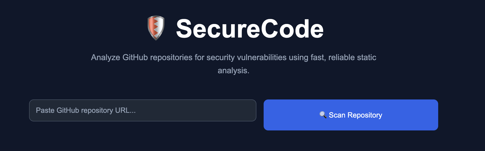
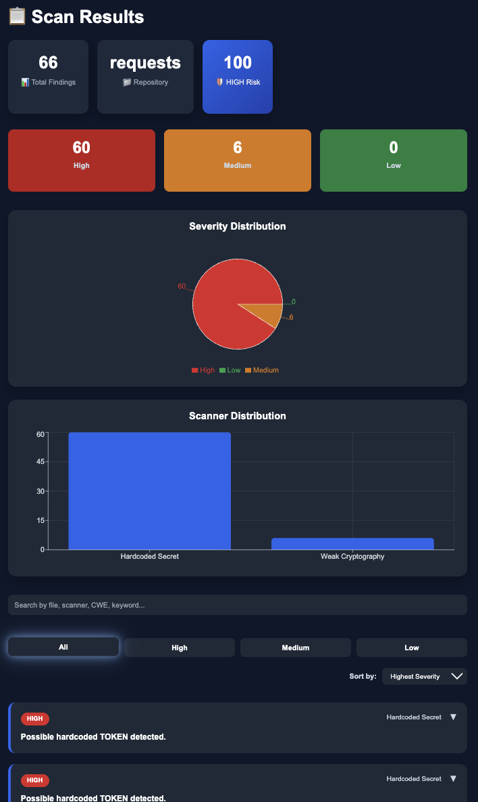
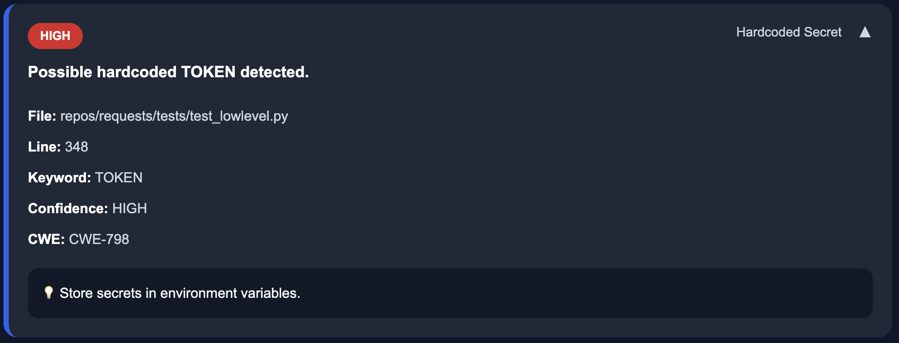

# 🛡️ SecureCode

A modern AI-assisted static code analysis platform that scans GitHub repositories for common security vulnerabilities and presents the results through an interactive security dashboard.


SecureCode analyzes public GitHub repositories using custom-built static analysis scanners to identify potential security vulnerabilities.

Instead of simply listing findings, SecureCode provides:

- Security severity summaries
- Risk scoring
- Interactive charts
- Search and filtering
- Expandable vulnerability explanations
- Downloadable JSON reports

The goal is to make security analysis simple, visual, and developer-friendly.

---

## Live Demo

**Frontend:** https://securecode-tau.vercel.app/

**Backend API (Swagger):** https://securecode.onrender.com/docs

---

## Screenshots

### Home



---

### Dashboard



---

### Expanded Finding



---

## Features

- Scan any public GitHub repository
- Detect hardcoded secrets
- Detect SQL injection patterns using Python AST analysis
- Detect weak cryptographic algorithms
- Interactive dashboard
- Severity distribution chart
- Scanner distribution chart
- Risk Score calculation
- Search findings instantly
- Filter by severity
- Sort findings
- Expandable finding cards
- Download JSON security reports
- Loading overlay while scanning
- Modern dark UI

---

## Tech Stack

### Frontend

- React
- Vite
- Axios
- Recharts
- CSS3

### Backend

- FastAPI
- Python 3.11
- GitPython
- Pydantic
- Python AST

---

## Architecture

```text
React Frontend
       │
       ▼
FastAPI Backend
       │
       ▼
Clone GitHub Repository
       │
       ▼
Run Security Scanners
       │
       ▼
Generate Risk Report
       │
       ▼
Interactive Dashboard
```

---

## Security Scanners

### Hardcoded Secret Scanner

Detects:

- API Keys
- Passwords
- Tokens
- Secrets

Severity:
HIGH

---

### Python AST SQL Scanner

Uses Python's Abstract Syntax Tree (AST) to detect SQL queries built using string concatenation.

Example:

```python
query = "SELECT * FROM users WHERE id=" + user_input
cursor.execute(query)
```

Severity:
HIGH

---

### Weak Cryptography Scanner

Detects insecure cryptographic algorithms including:

- MD5
- SHA1
- DES
- RC4

Severity:
MEDIUM

---

## Dashboard

The dashboard provides:

- Repository overview
- Severity statistics
- Risk score
- Interactive charts
- Search and filtering
- Sort findings
- Expandable vulnerability details
- Downloadable JSON reports

---

## Project Structure

```
SecureCode/
│
├── backend/
│   ├── app/
│   │   ├── scanners/
│   │   ├── routers/
│   │   ├── services/
│   │   ├── models/
│   │   └── main.py
│   │
│   └── requirements.txt
│
├── frontend/
│   ├── src/
│   ├── public/
│   └── package.json
│
└── README.md
```

---

## Installation

### Clone

```bash
git clone https://github.com/Samaika13/SecureCode.git

cd SecureCode
```

### Backend

```bash
cd backend

python -m venv venv

source venv/bin/activate
```

Windows

```bash
venv\Scripts\activate
```

Install packages

```bash
pip install -r requirements.txt
```

Run

```bash
uvicorn app.main:app --reload
```

---

### Frontend

```bash
cd frontend

npm install

npm run dev
```

---

## Future Improvements

- Additional security scanners
- Multi-language support
- Authentication
- Repository history
- PDF reports
- GitHub App integration
- CI/CD integration

---

## License

This project is licensed under the MIT License.

---

## Author

**Samaika Kanwar**

Computer Science Student

Purdue University

GitHub: https://github.com/Samaika13

LinkedIn: https://www.linkedin.com/in/samaikakanwar/